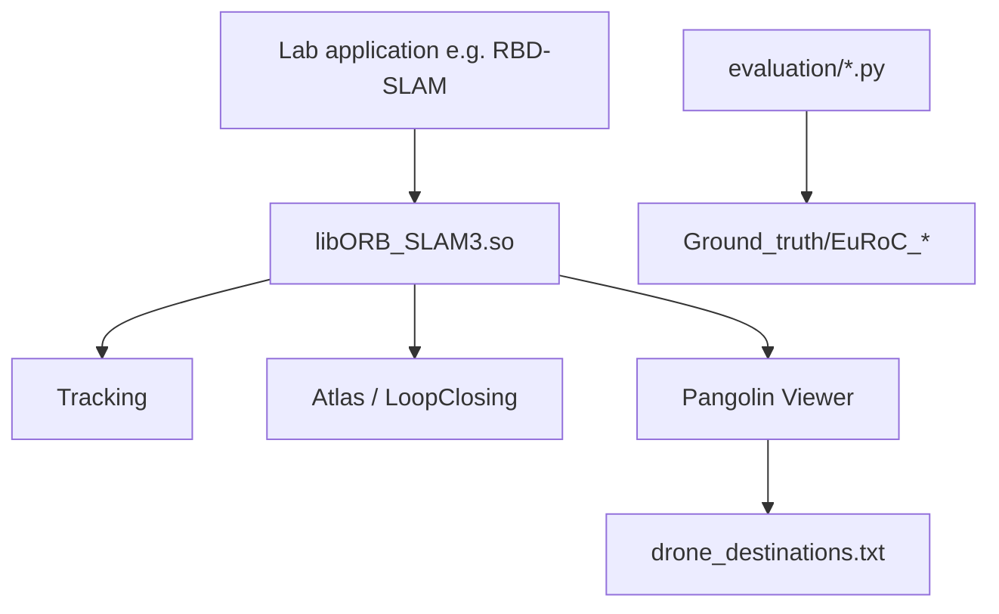

# ORB_SLAM3 (RBD Lab fork)

> **Repository:** [rbdlabhaifa/ORB_SLAM3](https://github.com/rbdlabhaifa/ORB_SLAM3)  
> **Upstream:** [UZ-SLAMLab/ORB_SLAM3](https://github.com/UZ-SLAMLab/ORB_SLAM3) (GPL-3.0)

## What is this project?

This is the **RBD Lab / VIAM fork** of **ORB-SLAM3** — a real-time visual, visual-inertial, and multi-map SLAM library supporting monocular, stereo, and RGB-D sensors (pinhole and fisheye models).

Unlike the upstream repository, **this fork ships the core library only**. The `Examples/` folder and demo executables were removed to keep the repo focused as a **dependency for lab projects** (navigation, drone waypoint marking, atlas persistence). It includes RBD-specific extensions: destination saving from the viewer, optional RRT/exit overlays in `MapDrawer`, atlas `.osa` export, and togglable map merging.

## What does it do?

| Capability | How |
|---|---|
| Build shared SLAM library | `./build.sh` → `lib/libORB_SLAM3.so` |
| Track camera pose | Link library; call `System::TrackMonocular` / `TrackStereo` / etc. |
| Save/load multi-map atlas | YAML `System.SaveAtlasToFile` or `SaveAtlasAsOsaWithTimestamp()` |
| Mark destinations in viewer | Pangolin menu → writes `drone_destinations.txt` |
| Evaluate trajectories | `evaluation/evaluate_ate_scale.py` + bundled EuRoC ground truth |
| Visualize exported maps | `plot_keyframes.py` (Open3D) |

**Typical workflow:**

```bash
git clone https://github.com/rbdlabhaifa/ORB_SLAM3.git
cd ORB_SLAM3 && ./build.sh
# Link libORB_SLAM3.so from your application (e.g. RBD-SLAM)
```

See **[demos/README.md](demos/README.md)** for API snippets and evaluation steps.

---

# 1. Project Overview

**Problem solved:** Provides a maintained, lab-customized ORB-SLAM3 core for University of Haifa RBD projects without carrying the full upstream example tree.

**Primary users:**

| Audience | Use |
|---|---|
| **RBD Lab developers** | Link `libORB_SLAM3.so` from C++ apps |
| **VIAM / drone work** | Save destinations, draw RRT paths in Pangolin |
| **Researchers** | EuRoC ATE evaluation scripts |

**What it is not:** A drop-in clone of upstream ORB-SLAM3 with RealSense/EuRoC demo binaries. Those were removed (`3b5d324 Remove unnecessary examples`). ROS nodes in `build_ros.sh` also require copying `Examples/ROS` from upstream.

**Notable branches:** `master` (default), `disable-merging`, `version2`, `ella/update_after_intallation_at_634ai`.

---

# 2. Architecture & Tech Stack

| Layer | Technology |
|---|---|
| Language | C++14 |
| Build | CMake 2.8+, `build.sh` |
| SLAM core | ORB-SLAM3 (`ORB_SLAM3` namespace) |
| Vision | OpenCV 3.2+ or 4.x |
| UI | Pangolin |
| Optimization | g2o, DBoW2 (Thirdparty/) |
| Lie algebra | Sophus (Thirdparty/) |
| Python utils | NumPy, Matplotlib, Open3D (`plot_keyframes.py`) |



**RBD-specific API additions** (`include/System.h`, `include/MapDrawer.h`):

- `System::destinations`, `SaveDestination()` via viewer menu
- `SaveAtlasAsOsaWithTimestamp()`, `ChangeMapMerging(bool)`
- `MapDrawer::draw_RRT`, `draw_exit`, `RRT_path`, `Exit_point`
- `System::get_map_drawer()`, `GetAtlas()`

---

# 3. Prerequisites

## Tested platforms

- **Ubuntu 20.04 / 22.04** (primary)
- macOS build support merged (`7970497`); Linux recommended for lab hardware

## System packages

```bash
sudo apt install build-essential cmake git \
  libopencv-dev libeigen3-dev libboost-all-dev libssl-dev \
  libpython3-dev python3-pip
```

## Pangolin (includes Eigen usage)

```bash
git clone --recursive https://github.com/stevenlovegrove/Pangolin.git
cd Pangolin
./scripts/install_prerequisites.sh recommended
mkdir build && cd build
cmake .. && make -j4 && sudo make install
```

## Python (evaluation / plotting)

```bash
pip3 install -r requirements.txt
```

## Bundled in repo

- `Thirdparty/DBoW2`, `g2o`, `Sophus`
- `Vocabulary/ORBvoc.txt.tar.gz` (extracted by `build.sh`)
- `evaluation/Ground_truth/` for EuRoC
- `Calibration_Tutorial.pdf`

## VIAM / lab setup notes

When building on Linux with **Homebrew also on PATH** (non-Pi RTK machines):

- Temporarily remove Homebrew from `PATH` so CMake finds system OpenCV/Eigen
- You may need to uninstall conflicting brew packages (`ncurses`, `libtiff`) during build
- Adjust OpenCV version in `CMakeLists.txt` if `find_package(OpenCV 4)` fails — try pinning to your apt version
- On Raspberry Pi: Sophus build may OOM — reduce `-j` in `build.sh` (default `make -j6`)

---

# 4. Environment Setup

## Clone

```bash
git clone https://github.com/rbdlabhaifa/ORB_SLAM3.git
cd ORB_SLAM3
```

## Configuration template

Copy the example settings file and calibrate for your camera:

```bash
cp config/settings.monocular.example.yaml config/my_camera.yaml
# Edit intrinsics; see Calibration_Tutorial.pdf for IMU/stereo/RGB-D fields
```

Key atlas keys:

```yaml
System.LoadAtlasFromFile: "/path/to/existing_atlas_basename"
System.SaveAtlasToFile: "/path/to/save_atlas_basename"
```

Paths omit the `.osa` extension; the library appends it on save.

No `.env` file. Runtime outputs (`drone_destinations.txt`, `CameraTrajectory.txt`, timing logs) write to the **process working directory**.

---

# 5. Build & Run Instructions

## Build library

```bash
chmod +x build.sh
./build.sh
```

Steps performed:

1. Build `Thirdparty/DBoW2`, `g2o`, `Sophus`
2. Extract `Vocabulary/ORBvoc.txt` from tarball
3. CMake + make → `lib/libORB_SLAM3.so`

## Run (via consumer app)

This repo does **not** ship runnable SLAM binaries. After building, link from your project:

```cmake
find_library(ORB_SLAM3 ORB_SLAM3 PATHS /path/to/ORB_SLAM3/lib)
target_link_libraries(your_app ${ORB_SLAM3} ...)
```

Minimal monocular loop — see [demos/README.md](demos/README.md).

## ROS (optional, requires upstream Examples)

```bash
# Copy Examples/ROS from UZ-SLAMLab/ORB_SLAM3 first
export ROS_PACKAGE_PATH=${ROS_PACKAGE_PATH}:/path/to/ORB_SLAM3/Examples/ROS
./build_ros.sh
```

## Tests / CI

No automated tests or CI configured. Validate with `./build.sh` success and a linked consumer smoke test.

---

# 6. Repository Structure

```
ORB_SLAM3/
├── CMakeLists.txt          # ★ Builds lib only (no Examples targets)
├── build.sh                # ★ Full build script
├── build_ros.sh            # ROS nodes (needs Examples/ROS from upstream)
├── config/
│   └── settings.monocular.example.yaml
├── Vocabulary/
│   └── ORBvoc.txt.tar.gz   # Extracted on build
├── include/ / src/         # ORB-SLAM3 core + RBD patches
├── Thirdparty/             # DBoW2, g2o, Sophus
├── evaluation/             # ATE scripts + EuRoC ground truth
├── plot_keyframes.py       # Open3D PCD viewer
├── demos/README.md
├── Calibration_Tutorial.pdf
├── Changelog.md
└── Dependencies.md
```

**Intentionally absent:** `Examples/`, `euroc_examples.sh`, `tum_vi_examples.sh` (upstream paths referenced in old README).

---

# 7. Core Workflows & Data Flow

## Workflow A — Library build & link

```
build.sh
  → Thirdparty libs + libORB_SLAM3.so
  → Consumer app links .so, passes Vocabulary + YAML settings
  → Track*() per frame → trajectory / atlas files
```

## Workflow B — Interactive mapping with destinations

```
System(..., bUseViewer=true)
  → Pangolin viewer
  → User clicks "SaveDestination"
  → drone_destinations.txt + System::destinations
```

## Workflow C — Trajectory evaluation

```
Consumer writes CameraTrajectory.txt
  → evaluation/associate.py
  → evaluation/evaluate_ate_scale.py
  → RMS ATE vs evaluation/Ground_truth/
```

**Read first:** `include/System.h`, `src/System.cc`, `include/MapDrawer.h`, `src/Viewer.cc` (SaveDestination menu).

---

# 8. Deployment & CI/CD

**Deployment:** Workstation or lab PC with OpenGL/Pangolin display. Built as a local shared library; no containers or cloud pipeline in repo.

**CI/CD:** None configured.

---

# 9. Known Quirks & Technical Debt

| Issue | Notes |
|---|---|
| **No Examples in repo** | Old README sections 4–7 describe upstream binaries; use [demos/README.md](demos/README.md) |
| **Library-only CMakeLists** | `build.sh` creates `bin/` but no example targets are defined |
| **OpenCV version probing** | Tries OpenCV 4 first, then 3.2 — may need manual `CMakeLists.txt` edit |
| **Map merging** | Toggle via `ChangeMapMerging()`; see `disable-merging` branch |
| **`REGISTER_TIMES`** | Uncomment in `include/Settings.h` (not `Config.h`) for timing dumps |
| **`build.sh` not idempotent** | Re-run may fail if `Thirdparty/*/build` exists — clean manually |
| **Aggressive `.gitignore`** | Ignores all then un-ignores patterns; `Examples/` paths listed but folder absent |
| **GPL-3.0** | Derivative works must comply; commercial license from original authors |

---

# 10. Troubleshooting / FAQ

### 1. `./build.sh` fails at Sophus on Pi

Reduce parallelism: edit `build.sh` to `make -j2` or `make -j1`.

### 2. OpenCV not found / wrong version

```bash
pkg-config --modversion opencv4
# Edit CMakeLists.txt find_package(OpenCV ...) if needed
```

### 3. Homebrew conflicts on Linux

```bash
export PATH=/usr/local/sbin:/usr/local/bin:/usr/sbin:/usr/bin:/sbin:/bin
# rebuild from clean build/ dirs
```

### 4. Vocabulary missing at runtime

Ensure `build.sh` completed the tar step:

```bash
ls Vocabulary/ORBvoc.txt
```

### 5. No demo executable after build

Expected — link `lib/libORB_SLAM3.so` from your app or restore `Examples/` from upstream.

### 6. `build_ros.sh` fails immediately

Copy `Examples/ROS/ORB_SLAM3` from [UZ-SLAMLab/ORB_SLAM3](https://github.com/UZ-SLAMLab/ORB_SLAM3) into this tree first.

---

## Upstream references

- Original README content (EuRoC, TUM-VI, ROS): [UZ-SLAMLab/ORB_SLAM3](https://github.com/UZ-SLAMLab/ORB_SLAM3)
- License: [GPL-3.0](LICENSE) — see [Dependencies.md](Dependencies.md)
- Citation: Campos et al., *IEEE T-RO* 2021 ([arXiv:2007.11898](https://arxiv.org/abs/2007.11898))

## Related RBD Lab projects

[AI634Code](https://github.com/rbdlabhaifa/AI634Code) · [RBD-SLAM](https://github.com/rbdlabhaifa/RBD-SLAM) · [SFM-SLAM](https://github.com/rbdlabhaifa/SFM-SLAM) · [colmap_lite_version](https://github.com/rbdlabhaifa/colmap_lite_version)
